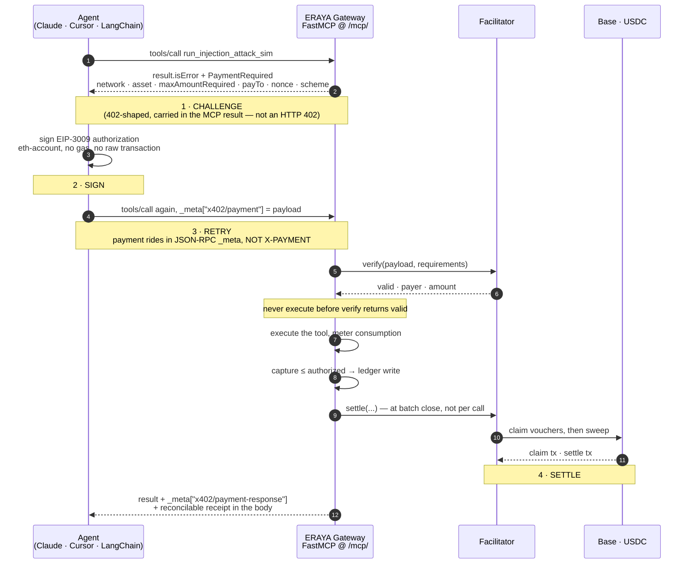
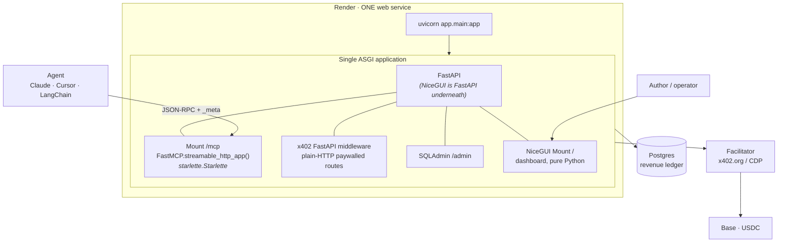
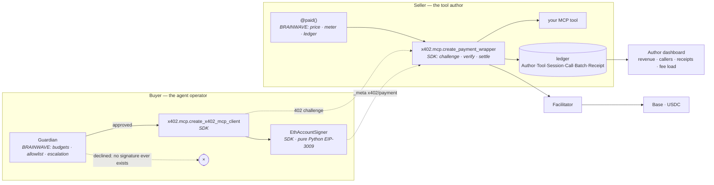
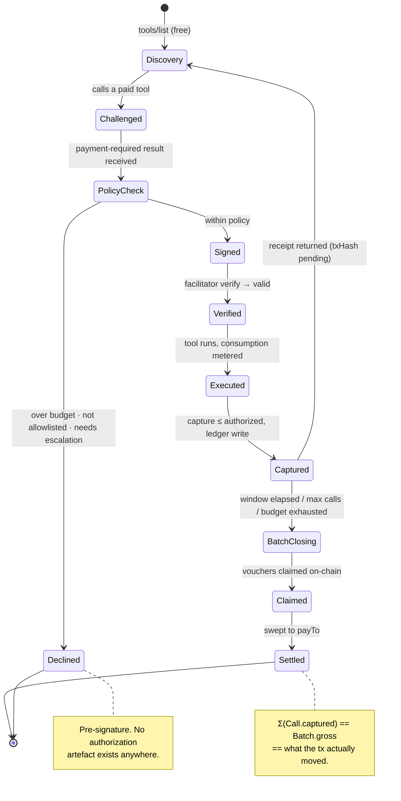
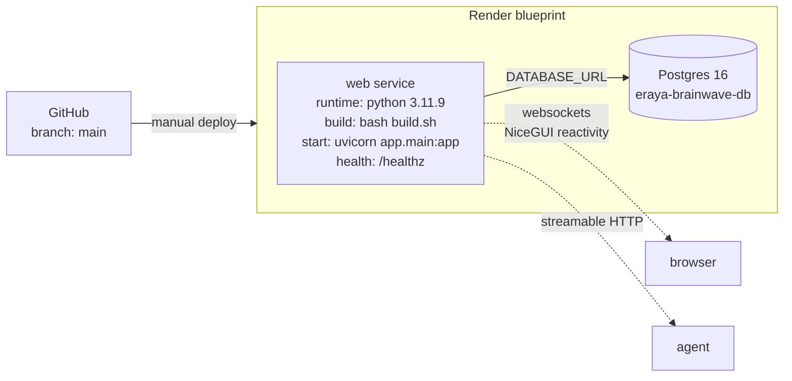

# ERAYA × BRAINWAVE

### Paid MCP — every agent tool call, metered and settled on-chain

> **X402 Blockchain Track · Agentic Payments**
>
> *MCP won the tool layer. This is its payment layer.*

[](https://x402.org)
[](https://base.org)
[](https://eips.ethereum.org/EIPS/eip-3009)
[](https://modelcontextprotocol.io)
[](https://python.org)
[-1abc9c)](https://nicegui.io)
[](#why-this-stack)

---

**The Model Context Protocol won the tool layer. It has no payment layer.**

Thousands of MCP servers now expose tools to Claude, Cursor, and every agent framework
shipping. Their authors have exactly one monetization path: none. No metering, no billing,
no way to charge for the expensive call — so the good tools stay private and the public ones
stay trivial.

ERAYA × BRAINWAVE is the missing meter. Register a tool, set a price, and every invocation
becomes an x402 payment — **Challenge → Sign → Retry → Settle**, USDC on Base — with a
reconcilable receipt returned inside the tool response.

```python
# app/catalogue.py — the seller-side integration, in full
@paid(price="$0.002", scheme="upto", max_price="$0.05", meter="tokens")
async def run_injection_attack_sim(payload: str, rounds: int = 3) -> dict:
    """Adversarial prompt-injection simulation. Cost scales with rounds."""
    ...
```

The agent never sees an API key. The author never runs a billing system.

---

## ⚠️ Deployment status: NOT YET DEPLOYED

**There is no live URL yet. Nothing has been deployed, no contract has been published, and no
on-chain transaction has been sent from this repository.** `render.yaml` and `build.sh` are
written and reviewed, but deliberately un-run — the operator deploys them by hand.

| Component | Location | Status |
|---|---|---|
| Gateway (paid MCP endpoint) | `https://…/mcp/` | **NOT YET DEPLOYED** |
| Author dashboard | `https://…/` | **NOT YET DEPLOYED** |
| Ledger admin | `https://…/admin/` | **NOT YET DEPLOYED** |
| `payTo` address | `0x…` | **NOT SET** — `PAY_TO_ADDRESS` is the zero address by default, and the app refuses to boot in production with it |
| Facilitator | `https://x402.org/facilitator` (public, testnet) · Coinbase CDP hosted (configured, not enabled) | Configured |
| Network | `eip155:84532` (Base Sepolia) | Config default |
| Demo video | `https://…` | Not yet recorded — see [`docs/DEMO_SCRIPT.md`](docs/DEMO_SCRIPT.md) |
| Repository | `https://github.com/martian3062/brainwave` | Branch `main` |

Any table in this README that reads like a live system is aspirational until this table is
filled in. Judges open these first; they are not filled in with a placeholder pretending to be
a URL.

---

## Table of contents

- [Why this exists](#why-this-exists)
- [What is the SDK's, and what is ours](#what-is-the-sdks-and-what-is-ours)
- [The x402 flow, end to end](#the-x402-flow-end-to-end)
- [Transport: `_meta` over MCP, headers over HTTP](#transport-_meta-over-mcp-headers-over-http)
- [Architecture — one service](#architecture--one-service)
- [Why this stack](#why-this-stack)
- [The unit economics problem — and how we solve it](#the-unit-economics-problem--and-how-we-solve-it)
- [Receipts](#receipts)
- [Spend policy — the Guardian](#spend-policy--the-guardian)
- [What the ledger proves](#what-the-ledger-proves)
- [Tech stack](#tech-stack)
- [Repository structure](#repository-structure)
- [Quick start](#quick-start)
- [Request-path map](#request-path-map)
- [Build status — what is real, what is not](#build-status--what-is-real-what-is-not)
- [Prior work disclosure](#prior-work-disclosure)
- [Testing](#testing)
- [Documentation](#documentation)
- [Roadmap](#roadmap)

---

## Why this exists

### The paying customer, named

This project has two, and both already exist in volume:

| Customer | Pain today | What they pay for |
|---|---|---|
| **MCP tool authors** | Built something genuinely expensive to run — an LLM chain, an adversarial simulation, a scraper, model inference. Cannot charge for it. Options are: publish free and eat the cost, or don't publish. | Revenue per call, with zero billing infrastructure |
| **Agent operators** | Want premium tools. Every one means a signup, an API key, a card on file, a subscription they under-use. An autonomous agent cannot do any of that. | Access without accounts, metered to actual use |

The second is the sharper one. **An agent cannot sign up for anything.** It has no email, no
card, no ability to click "I agree." Every subscription-shaped business is structurally closed
to autonomous software. x402 is the fix, and MCP is where agents actually reach for tools.

### Why now

x402 is stewarded by the x402 Foundation under the Linux Foundation, and Base carries the
large majority of its settlement volume. The protocol's direction of travel is deeper
integration with agent frameworks and tool protocols — MCP specifically. Cloudflare ships
paid-MCP helpers, but its managed Monetization Gateway is early-access/waitlist, not generally
available.

**That gap is the opportunity: a framework-agnostic, self-hostable paid-MCP layer that is not
locked to one vendor's edge network.**

---

## What is the SDK's, and what is ours

This section is first, before any architecture, because getting it wrong would be the single
most dishonest thing this submission could do.

**The x402 Python SDK already implements paid MCP.** `x402.mcp` exports
`create_payment_wrapper`, `create_x402_mcp_client`, `x402MCPSession`, `PaymentRequiredError`
and the `_meta` key constants. It performs the 402 challenge, the facilitator `verify`, tool
execution, and the facilitator `settle`. **We did not write that, and we do not claim to.**

Our `@paid()` decorator is a *thin ergonomic wrapper over `create_payment_wrapper`* — it adds
price parsing, metering, and ledger writes around a protocol implementation that is entirely
the SDK's. This is stated in the source, not just here.

| Layer | Whose | What it is |
|---|---|---|
| 402 challenge shape, `PaymentRequirements` | **SDK** | `x402.schemas.payments` |
| `verify` / `settle` facilitator calls | **SDK** | `x402.facilitator`, `x402.http.facilitator_client` |
| EIP-3009 / Permit2 signing | **SDK** | `x402.mechanisms.evm.signers` — pure Python, `eth-account` |
| `exact` / `upto` / `batch-settlement` schemes | **SDK** | `x402.mechanisms.evm.*` |
| Paid MCP server wrapper | **SDK** | `x402.mcp.create_payment_wrapper` |
| Paid MCP client | **SDK** | `x402.mcp.create_x402_mcp_client` |
| MCP `_meta` payment transport | **SDK** | `MCP_PAYMENT_META_KEY`, `MCP_PAYMENT_RESPONSE_META_KEY` |
| Plain-HTTP paywall middleware | **SDK** | `x402.http.middleware.fastapi.payment_middleware` |
| — | — | — |
| **Price declaration + exact atomic-unit parsing** | **BRAINWAVE** | `app/money.py`. No float anywhere. `$0.0000001` at 6 decimals is an error, not a rounding |
| **Metering** (`upto` capture from real consumption) | **BRAINWAVE** | `Call.meter` / `meter_units`, DB CHECK `captured ≤ authorized` |
| **Revenue ledger + per-author accounting + platform take** | **BRAINWAVE** | `app/models.py` — six tables, conservation enforced by CHECK constraints |
| **Session batching economics** | **BRAINWAVE** | The `Session` → `Batch` model over the SDK's `batch-settlement` channel. We do not reimplement the mechanism |
| **Buyer-side spend Guardian** | **BRAINWAVE** | Genuinely absent upstream — `x402/hook_policy.py` guards hook *mutations*, not spend |
| **Receipt reconciliation** (call → session → batch → tx) | **BRAINWAVE** | `Receipt` carries `session_id`, `batch_id`, `tx_hash`, `body_hash` |
| **Author dashboard** | **BRAINWAVE** | NiceGUI, pure Python |
| **Simulation / conformance CLI** | **BRAINWAVE** | Built — `python -m app.cli simulate` and the read-only `doctor` audit |

**We built the business layer on the SDK's protocol layer.** That is true, and it is a stronger
claim than a false invention would be — a judge who knows the SDK would catch the other one in
thirty seconds.

---

## The x402 flow, end to end



Four steps, all of them the SDK's implementation, all of them exercised — not stubbed, and not
reimplemented.

The agent signs an *authorization*, never a raw transaction. It needs no gas, no chain
selection, no bridging logic. The facilitator executes settlement. That separation is what
makes the flow usable by software with no blockchain knowledge.

---

## Transport: `_meta` over MCP, headers over HTTP

**This is the one thing the original spec draft got wrong, and it matters.**

| Path | Request carries payment in | Response carries receipt in |
|---|---|---|
| **MCP** (`/mcp/`, JSON-RPC over streamable HTTP) | `_meta["x402/payment"]` | `_meta["x402/payment-response"]` |
| **Plain HTTP** (paywalled REST routes on the same server) | `PAYMENT-SIGNATURE` header (`X-PAYMENT` accepted as **v1 legacy**) | `PAYMENT-RESPONSE` header (`X-PAYMENT-RESPONSE` legacy) |

Verified against the installed wheel: the constants live in `x402/http/constants.py`
(`PAYMENT_SIGNATURE_HEADER = "PAYMENT-SIGNATURE"`, with `X_PAYMENT_HEADER = "X-PAYMENT"`
explicitly commented `# V1 legacy`), and the MCP keys live in `x402/mcp/` as
`MCP_PAYMENT_META_KEY = "x402/payment"` and
`MCP_PAYMENT_RESPONSE_META_KEY = "x402/payment-response"`.

**This server uses both paths**, so the distinction is enforced in three places rather than
merely documented:

- `GET /api/config` returns the two transports as separate objects.
- The free `gateway_info` MCP tool says so in its response, because reaching for an HTTP header
  over MCP is the most common integration mistake.
- The plain-HTTP paywall middleware **must** short-circuit `/mcp*` — running it there would
  hunt for a header that is correctly never present.

Over MCP there is also no literal HTTP 402 status. The challenge is a payment-required *result*
inside a 200 JSON-RPC response. Same four steps, different envelope.

---

## Architecture — one service



No worker. No Redis. No static site. No Node build step. **One process, one lifespan, one
deploy.**

### Seller side / buyer side



Either half works alone against any spec-compliant counterparty. That is the point of building
on an open standard rather than a vendor SDK.

### Session lifecycle



Under `batch-settlement` the accumulator is a payment **channel** carrying a monotonic
cumulative voucher — so `Session.authorized_atomic` is a *ceiling*, not a sum of independent
authorizations, and a batch has **two** on-chain hashes (`claim_tx_hash`, `settle_tx_hash`).
Both facts are modelled in the schema because getting them wrong makes reconciliation lie.

### Render topology



**One web service, one database. Nothing else.** `build.sh` runs
`pip install -r requirements.txt && alembic upgrade head`; the start command is
`uvicorn app.main:app --host 0.0.0.0 --port $PORT`. Render supports websockets on the standard
HTTP port with nothing to enable, which NiceGUI needs for reactive updates and MCP
streamable-HTTP needs for long-lived connections.

---

## Why this stack

**NiceGUI *is* FastAPI underneath.** That single fact buys three things at once, and it is the
whole reason this is one process instead of three:

1. **x402 ships official FastAPI middleware** — `x402.http.middleware.fastapi.payment_middleware`.
   There is no Django middleware. Being FastAPI-shaped means first-party support for the
   plain-HTTP paywall instead of a hand-rolled 402.

2. **`FastMCP.streamable_http_app()` returns a `starlette.applications.Starlette`** — verified
   by running it. FastAPI mounts that in **one line**. Against a Django project the same thing
   needed a hand-written ASGI path dispatcher with fragile lifespan handling.

3. **A real frontend in pure Python** — reactive components, tables, and built-in ECharts, with
   **no HTML, CSS, JS, Node or npm anywhere in this repository.** There is no `package.json`.
   The palette lives as Python string constants in `app/dashboard.py`.

### The one genuinely tricky integration point

A mounted sub-app's lifespan **never runs**. Starlette dispatches the `lifespan` scope in
`Router.lifespan()`; `Mount` matches only `http` and `websocket`. And
`FastMCP.streamable_http_app()` returns
`Starlette(..., lifespan=lambda app: self.session_manager.run())` — so mounting it naively
*looks* correct (routes resolve, nothing is logged) and then **every `tools/call` returns 500**.

Reproduced both ways. The fix is one line in the parent lifespan:

```python
async with mcp_asgi.router.lifespan_context(mcp_asgi):
    yield {"mcp_started": True}
```

Going through `router.lifespan_context` rather than `session_manager.run()` directly means any
future FastMCP startup work comes along for free. `ui.run_with()` wraps this lifespan rather
than replacing it — confirmed by probe. And `/healthz` returns **503** with
`"mcp_session_manager": "NOT STARTED"` if it ever regresses, so a broken wiring fails at deploy
instead of at the first paid call.

Full detail, including the composition-order rule and three other SDK contradictions found by
running the wheels: [`docs/ARCHITECTURE.md`](docs/ARCHITECTURE.md).

---

## The unit economics problem — and how we solve it

This is the section most submissions will not have, and it is the one that decides whether any
of this is a business.

**The naive design settles every call on-chain. At micro prices, that is not merely inefficient
— it is loss-making.** Coinbase's CDP facilitator is free for the first 1,000 transactions per
month, then $0.001 per transaction. A $0.002 tool call produces $0.0002 of platform take and
costs $0.001 to settle: **the platform spends five times the revenue it earns on that call.**

| | Per-call settlement | **Batched session (N=100)** |
|---|---:|---:|
| Tool price | $0.002 | $0.002 |
| Calls | 1 | 100 |
| Gross revenue | $0.002 | $0.200 |
| On-chain settlement events | 1 | **2** (claim + sweep, for the whole batch) |
| Facilitator cost | $0.001 | $0.002 |
| **Fee load** | **50%** | **1.0%** |
| Author net (90% of gross) | $0.0018 | $0.180 |
| Platform take (10% of gross) | $0.0002 | $0.020 |
| **Platform margin** (take − fee) | **−$0.0008 · loss** | **+$0.018 · profit** |
| Settlement's share of the take | **500%** | **10%** |

The ledger decides who pays: `CHECK ck_batch_split_conserves` is
`platform_fee + author_net = gross`, with `facilitator_fee_atomic` deliberately **outside** that
identity. **The platform absorbs the settlement fee out of its own take** — the way Stripe
absorbs interchange rather than surprising the merchant with it. The author's cut is a fixed
share of gross either way, so batching is not an author feature; it is the reason the
marketplace survives to keep paying the author.

Three results fall out of the model, all derived in [`docs/ECONOMICS.md`](docs/ECONOMICS.md):

- **Per-call settlement has a hard price floor of `f / t` = $0.01 per call.** Every tool cheaper
  than that loses money on every invocation. That floor prices the entire micro-tool category —
  one lookup, one simulation round, one classification — out of existence.
- **Break-even batch size is `N* = ceil(k·f / (p·t))` = 10 calls.** Ten calls per batch is where
  this becomes a business. Batching beats per-call settlement from the third call (`N > k`).
- **At a million calls a month, the facilitator bill goes from $999 to $19** — a $980 swing on
  $2,000 of gross, and the difference between a marketplace that compounds and one that pays to
  exist.

> **Two corrections made while building, recorded rather than quietly applied.** The project
> brief modelled batching as *one* settlement per batch (0.5% fee load) and charged the fee to
> the author. Reading `x402.mechanisms.evm.batch_settlement` shows the close is **two** on-chain
> steps — `ClaimPayload` then `SettlePayload` — so `k = 2` and the honest fee load at N=100 is
> 1.0%; and the schema's CHECK constraint shows the platform, not the author, bears the fee.
> The argument survives both corrections and gets sharper for it. Publishing the flattering
> number would not have survived a judge reading the SDK.

### How the batching works

x402 defines three EVM schemes. This project uses all three, each where it belongs:

| Scheme | Used for | Why |
|---|---|---|
| `exact` | Fixed-price tools | Simplest, deterministic |
| `upto` | **Variable-cost tools** | An LLM-backed tool does not know its cost until it runs. The agent authorizes a ceiling; only actual consumption is captured. This is the scheme most people miss |
| `batch-settlement` | **Session accumulation** | Deposit once into a channel, raise a cumulative voucher per call, close the whole session in one claim+sweep |

`upto` deserves emphasis: for any tool whose cost scales with input — token counts, document
length, rounds of simulation — a fixed price is either a loss on big inputs or a rip-off on
small ones. It is the only honest pricing primitive for LLM-backed tools, and the DB enforces
its invariant with a CHECK constraint so a metering bug is a database error rather than a silent
overcharge.

Full model, the real CDP fee schedule, break-even formulas and sensitivity tables:
[`docs/ECONOMICS.md`](docs/ECONOMICS.md).

---

## Receipts

Every successful paid call returns a receipt in the response body, alongside the SDK's own
`_meta["x402/payment-response"]`:

```jsonc
{
  "result": { /* the tool's actual output */ },
  "_receipt": {
    "receiptId":   "rcpt_01HZY…",
    "scheme":      "upto",
    "network":     "eip155:84532",       // CAIP-2, not "base-sepolia"
    "asset":       "0x036CbD…",
    "assetDecimals": 6,
    "authorized":  "0.050000",           // atomic units, rendered exactly
    "captured":    "0.007400",           // actual consumption
    "meter":       "tokens",
    "meterUnits":  1842,
    "payer":       "0xAGENT…",
    "payTo":       "0xAUTHOR…",
    "resource":    "mcp://tool/run_injection_attack_sim",
    "session":     "sess_01HZY…",
    "settlement":  "batched",
    "batchId":     "batch_01HZY…",
    "claimTxHash": null,                 // populated at batch close
    "settleTxHash": null,
    "explorer":    null,
    "facilitator": "x402.org",
    "attestation": "0x…",                // facilitator signature, when provided
    "bodyHash":    "sha256:…",           // ours — local tamper detection
    "issuedAt":    "2026-07-27T09:14:22Z"
  }
}
```

Four properties make this useful rather than ornamental:

1. **Honest about capture.** With `upto`, `authorized` and `captured` differ. Showing both is
   the difference between a payment system and a black box.
2. **Reconcilable.** `session` + `batchId` + the two tx hashes let an author tie any individual
   call to the on-chain settlement that paid for it — the thing that makes this survivable by
   an accountant. The `Receipt` table stores all of them.
3. **Tamper-evident locally.** `bodyHash` is a sha256 over the canonical body, so a modified
   receipt fails before anyone calls the facilitator. This one is ours.
4. **Independently verifiable.** `attestation` is the facilitator's signature over the receipt
   body, checkable without trusting this gateway.

`GET /receipts/{id}/verify` re-checks the hash, the attestation and the on-chain transfer, and
is a **free** endpoint. Verification must never be paywalled — and `tools/list` and
`gateway_info` are free for the same reason: an agent has to be able to discover a price before
it can decide to pay it.

---

## Spend policy — the Guardian

An agent with a wallet and no ceiling is an unbounded liability. No operator ships that.

**The SDK does not provide this.** `x402/hook_policy.py` exists but guards hook *mutations*, not
spend. A buyer-side budget/allowlist/escalation gate genuinely does not exist upstream, which is
why it is one of BRAINWAVE's real contributions. The design pattern — a policy gate that vets an
action before it executes — is carried over from ERAYA's `core/agents/guardian.py`, but the
domain is different (spend budgets, not action safety) and the implementation is written from
scratch.

```python
from app.guardian import Guardian

guardian = Guardian(
    session_budget="$5.00",  # hard cap per session
    per_call_max="$0.10",  # reject expensive surprises
    daily_budget="$50.00",
    allowlist=["mcp://tools.eraya.dev/*"],
    require_receipt=True,  # refuse tools that do not return one
    escalate_above="$1.00",  # human confirmation required
)
```

| Control | Behaviour on breach | Ledger effect |
|---|---|---|
| `per_call_max` | Typed decline, tool call fails cleanly | `Call.status = declined`, `decline_reason = "per_call_max"` |
| `session_budget` | Session frozen; whatever was consumed still settles honestly | `Session.status = frozen` |
| `daily_budget` | Same, across sessions for that payer | `decline_reason = "over_daily_budget"` |
| `allowlist` | Unknown origins never receive a signature | `decline_reason = "not_allowlisted"` |
| `require_receipt` | Response rejected if no verifiable receipt | `decline_reason = "no_receipt"` |
| `escalate_above` | Blocks and emits an approval request | `decline_reason = "needs_escalation"` |

Policy is evaluated locally, **before the signature exists**. A payment that was never signed
cannot be settled — which is the entire reason this check belongs to the buyer rather than being
trusted to the seller. Declines are still written to the ledger, because the dashboard needs the
conversion funnel and not just the wins.

---

## What the ledger proves

Six tables — `Author → Tool → Call`, grouped by `Session`, evidenced by `Receipt`, settled by
`Batch` — all of them existing to make one claim checkable **from the database alone**:

> `Σ(Call.captured_atomic)` for a session **==** the `Batch.gross_atomic` that was settled
> on-chain **==** what the tx hash actually moved.

These are not comments. They are constraints the database enforces:

| Invariant | Enforcement |
|---|---|
| Capture never exceeds authorization (the `upto` guarantee) | `CHECK ck_call_capture_le_authorized` |
| Revenue split conserves exactly | `CHECK ck_call_split_conserves` — `platform + author = captured` |
| Batch split conserves exactly | `CHECK ck_batch_split_conserves` |
| A session never settles more than it captured | `CHECK ck_session_settled_le_captured` |
| An `upto` ceiling is never below its base price | `CHECK ck_tool_ceiling_ge_price` |
| An authorization nonce is used at most once per network | `UNIQUE (network, nonce)` |
| Money never becomes a float | `BIGINT` atomic units on every `*_atomic` column, pinned by `test_no_float_columns_anywhere_in_the_ledger` and `test_money_columns_are_bigint` |
| Enum columns store the **wire** value | `VARCHAR(32)`, pinned by `test_enum_columns_store_the_x402_wire_value_not_the_member_name` — the ledger holds `batch-settlement`, not `BATCH_SETTLEMENT` |

`BigInteger` is explicit throughout because SQLModel maps a bare `int` to a 32-bit `INTEGER` on
Postgres, which overflows at roughly 2,147 USDC. `app/money.py` is the only converter in the
repository, and `Decimal` never escapes it.

---

## Tech stack

| Layer | Choice | Why |
|---|---|---|
| Protocol | **x402 v2** (`x402[all]==2.16.0`) | Open standard, Linux Foundation stewarded; the SDK already implements paid MCP |
| Chain | **Base** — `eip155:84532` dev, `eip155:8453` mainnet | Carries the majority of x402 volume. Switching is one env var; no code path differs |
| Asset | **USDC** via EIP-3009; other ERC-20s via the `upto` Permit2 variant | Addresses read from `x402.mechanisms.evm.constants.NETWORK_CONFIGS`, not from memory |
| Facilitator | **x402.org public** (testnet) · **Coinbase CDP** hosted (configured) | 1,000 tx/month free tier |
| Signing | **`eth-account`** via `x402.mechanisms.evm.signers` | Pure Python. **No JavaScript anywhere** — the spec's Next.js buyer shim is unnecessary |
| Tool layer | **MCP** `mcp==1.28.1`, FastMCP streamable HTTP | Where agents actually reach for tools |
| Server | **FastAPI 0.140.2** / **Starlette 1.3.1** / **uvicorn 0.51.0** | NiceGUI is FastAPI underneath, so this is free |
| Dashboard | **NiceGUI 3.15.0** — pure Python, built-in ECharts | No HTML, CSS, JS, Node, npm, TypeScript, or Next.js in this repository |
| Ledger admin | **SQLAdmin 0.29.0** at `/admin` | Raw editable rows for fixing a stuck batch at 2am |
| Ledger | **Postgres 16** + **SQLModel 0.0.39** / SQLAlchemy 2.0.51 | Receipts must survive a restart. SQLite fallback so a clone runs with zero setup |
| Migrations | **Alembic 1.18.5** | `build.sh` runs `alembic upgrade head`; applies and downgrades cleanly with zero drift |
| Batching | The SDK's opt-in `batch-settlement` channel + encrypted Postgres `channel_state` + our `Session`/`Batch` accounting | Exact and `upto` settle per call by default; signed channel material never enters the reporting ledger |
| Runtime | **Python 3.11.9** (`runtime.txt`) | `StrEnum` and 3.11+ typing throughout |
| Hosting | **Render** — one web service + one Postgres | See `render.yaml` |
| Testing | **pytest** — 552 tests | Payment, transport, ledger, dashboard, CLI, client, migration, and hostile-facilitator cases are pinned |

### Deliberately not used

| Rejected | Reason |
|---|---|
| Node / npm / TypeScript / Next.js | `x402.mechanisms.evm.signers` signs EIP-3009 in pure Python. A JS buyer shim would add a toolchain to solve a problem that does not exist |
| Django | No x402 Django middleware exists, and mounting FastMCP would need a hand-written ASGI dispatcher with fragile lifespan handling |
| Cloudflare Monetization Gateway | Early access / waitlist, not GA — cannot build a submission on it |
| A parallel batching mechanism | `x402.mechanisms.evm.batch_settlement` is extensive and channel-based. Inventing a second one beside it would be worse and dishonest |
| `dj-database-url` | SQLAlchemy parses `DATABASE_URL` directly; `app/db.py` only rewrites Render's legacy `postgres://` scheme |
| Redis + APScheduler | One process, one deploy. Batch close runs in-process |
| A custom reputation schema | ERC-8004 exists; `Session.agent_identity` carries it |
| A bespoke `X-Payment` proof format | ERAYA's earlier Casper implementation used one. It is non-standard. Superseded here by real x402 |

---

## Repository structure

```
brainwave/
├── app/
│   ├── __init__.py          # scope statement: what is the SDK's, what is ours
│   ├── config.py            # every env var · CAIP-2 validation · SQLite fallback
│   ├── money.py             # integer atomic units — the ONLY money conversion
│   ├── models.py            # ledger models + encrypted ChannelState storage row
│   ├── channels.py          # durable encrypted SDK channel storage + claim recovery
│   ├── db.py                # engine, sessions, postgres:// rewrite, SQLite pragmas
│   ├── mcp_app.py           # FastMCP server: mount path + DNS-rebinding gotchas
│   ├── admin.py             # SQLAdmin over the ledger, money-formatted
│   ├── dashboard.py         # NiceGUI pages + the ERAYA palette (Python constants)
│   ├── main.py              # THE SPINE: composition order + combined lifespan
│   ├── catalogue.py         # the live paid/free MCP catalogue
│   ├── gateway/             # MCP transport adapter; live @paid() calls shared pay core
│   ├── pay/                 # pricing, metering, settlement, batching and receipts
│   └── client/              # buyer-side Guardian, signer and paid MCP client
├── alembic/
│   ├── env.py               # takes the URL from app.db, so alembic.ini carries none
│   └── versions/            # ledger, demo provenance and encrypted channel state
├── tests/
│   └── test_*.py            # 552 tests across the complete application
├── docs/
│   ├── ARCHITECTURE.md      # ASGI composition, lifespan, request-path map
│   ├── ECONOMICS.md         # the full model, real fee schedule, break-even
│   ├── SPEC_CONFORMANCE.md  # SDK's vs ours, feature by feature
│   └── DEMO_SCRIPT.md       # the video, shot by shot, timestamped
├── render.yaml              # one web service + one Postgres. NOT APPLIED
├── build.sh                 # pip install && alembic upgrade head. NOT RUN
├── runtime.txt              # python-3.11.9
├── requirements.txt         # pinned to the wheels actually installed and probed
├── pyproject.toml
├── alembic.ini
└── .env.example             # every value is a default the app already uses
```

The optional plain-HTTP paywall remains a soft seam. It is separate from the paid MCP transport,
which is implemented and covered by the end-to-end test suite.

---

## Quick start

### Prerequisites

- **Python 3.11+** — that is the entire list. No Node, no pnpm, no npm.
- Optional: a funded **Base Sepolia** wallet with test USDC, to make a real payment.
- Optional: a **CDP account** for the hosted facilitator (the public testnet facilitator needs
  no credentials).

### 1 · Install

```bash
git clone https://github.com/martian3062/brainwave.git
cd brainwave

python -m venv .venv
.venv/Scripts/activate          # Windows
# source .venv/bin/activate     # macOS / Linux

pip install -r requirements.txt
```

### 2 · Configure — optional

A fresh clone runs with **no `.env` at all**: SQLite on disk, Base Sepolia, the public x402
facilitator, and safe per-call settlement for `exact`/`upto`. Copy the example only to change
something:

```bash
cp .env.example .env
```

The variables that matter most:

```ini
PUBLIC_BASE_URL=http://localhost:8000   # MUST match the deploy host — see the 421 note below
X402_NETWORK=eip155:84532               # CAIP-2. Mainnet is eip155:8453
PAY_TO_ADDRESS=0x…                      # where tool revenue lands
PLATFORM_TAKE_BPS=1000                  # 10%
BATCHING_ENABLED=false                  # opt in only for SDK batch-settlement channels
CHANNEL_STORAGE_BACKEND=database        # encrypted with STORAGE_SECRET
SESSION_BUDGET=$5.00                    # buyer-side Guardian
```

### 3 · Migrate and run

```bash
alembic upgrade head
uvicorn app.main:app --reload --port 8000
```

Open <http://localhost:8000> for the dashboard, `/admin` for the ledger, `/api/docs` for the
OpenAPI UI, and `/healthz` to confirm the MCP session manager actually started.

### 4 · Point an agent at it

The MCP endpoint is **`http://localhost:8000/mcp/`** — note the trailing slash. The bare `/mcp`
307-redirects to it, preserving the method and the JSON-RPC body.

```python
import httpx
from x402.mcp import create_x402_mcp_client  # the SDK's client

async with httpx.AsyncClient() as http:
    async with create_x402_mcp_client(http, "http://localhost:8000/mcp/") as m:
        print(await m.call_tool("gateway_info", {}))  # free
        print(await m.call_tool("run_injection_attack_sim", {...}))  # paid
```

Or from Claude Desktop / Cursor, via any MCP client that speaks streamable HTTP.

### 5 · Verify the wiring before blaming the protocol

```bash
curl -s localhost:8000/healthz | python -m json.tool
```

`"mcp_session_manager": "started"` and HTTP 200 mean the mounted MCP lifespan ran. **503 with
`"NOT STARTED"`** means it did not, and every paid call would 500 — see
[the lifespan trap](#the-one-genuinely-tricky-integration-point).

```bash
curl -s localhost:8000/api/config | python -m json.tool
```

Tells you the network, asset, facilitator, settlement mode, and — separately for each transport
— exactly where payment travels.

### Two failure modes that look like protocol bugs

| Symptom | Cause | Fix |
|---|---|---|
| Every MCP request returns **421 Invalid Host header** | `mcp==1.28.1` enables DNS-rebinding protection **by default**, allowing only `127.0.0.1:*`, `localhost:*`, `[::1]:*`. On `*.onrender.com` that rejects everything | Set `PUBLIC_BASE_URL` to the real host. The host allowlist is derived from it automatically; `MCP_ALLOWED_HOSTS` adds extras |
| An agent gets an **HTML 404** from `/mcp` | `Mount("/mcp")` compiles to `^/mcp(?P<path>/.*)$` and never matches the bare path; NiceGUI's `Mount("/")` swallows it | Already handled — `app/main.py` registers an explicit 307. Use `/mcp/` |

---

## Request-path map

| Path | Served by | Auth | Paid |
|---|---|---|---|
| `/` | NiceGUI dashboard (`Mount("/")`, registered **last**) | none | no |
| `/_nicegui/*` | NiceGUI static + websocket | none | no |
| `/mcp/` | `FastMCP.streamable_http_app()` (`Mount("/mcp")`) | none at transport | **per tool**, via `_meta` |
| `/mcp` | 307 → `/mcp/` (preserves method + body) | — | — |
| `/admin/` | SQLAdmin | operator login (required in production) | no |
| `/admin` | 307 → `/admin/` | — | — |
| `/healthz` | FastAPI — 200 healthy / **503 if MCP lifespan did not run** | none | no |
| `/api/config` | FastAPI — everything an agent operator needs | none | no |
| `/api/docs`, `/api/openapi.json` | FastAPI (moved off `/docs` because NiceGUI owns `/`) | none | no |
| `/receipts/{id}/verify` | FastAPI — re-checks hash, attestation, chain | none | **never** |

Registration order is load-bearing: Starlette resolves routes in order and `Mount("/")` matches
everything, so `ui.run_with(app)` must be the **last** line of `app/main.py`. Verified by
reproducing the failure — with NiceGUI mounted first, a POST to `/mcp/` returns NiceGUI's HTML
404 page.

---

## Build status — what is real, what is not

The track requires a working MVP. Here is the audit trail, with no green ticks bought on
credit.

| Component | Status | Evidence |
|---|---|---|
| ASGI spine: FastAPI + mounted FastMCP + SQLAdmin + NiceGUI | ✅ **Built** | `app/main.py`; 552 tests pass |
| Combined lifespan (the 500-on-every-call trap) | ✅ **Built & pinned** | `test_mcp_lifespan_actually_ran`, `test_mounted_lifespan_does_not_run_on_its_own` |
| Revenue ledger schema, 6 tables, all invariants as DB constraints | ✅ **Built** | `app/models.py`; migration applies **and downgrades** with zero drift |
| Exact integer money, no float anywhere | ✅ **Built & pinned** | `app/money.py`; `test_no_float_columns_anywhere_in_the_ledger` |
| Economic model computed, not asserted | ✅ **Built & pinned** | `test_the_headline_economic_claim`; the dashboard computes fee load from the ledger's own numbers |
| MCP endpoint speaking JSON-RPC, free tool discoverable | ✅ **Built** | `test_paid_mcp_endpoint_speaks_json_rpc`, `test_tools_list_includes_the_free_tool` |
| SQLAdmin ledger view | ✅ **Built** | `test_admin_is_mounted_and_reachable` |
| NiceGUI dashboard (skeleton: network, asset, settlement, fee load, endpoints) | ✅ **Built** | `test_nicegui_serves_the_dashboard_at_root` |
| Transport precision (`_meta` vs headers) surfaced in three places | ✅ **Built & pinned** | `test_public_config_is_precise_about_the_two_transports` |
| Render blueprint + build script | ✅ **Written**, ⛔ **not run** | `render.yaml`, `build.sh` — deployed by hand, by the operator |
| Paid tool catalogue (`@paid()` over `create_payment_wrapper`) | ✅ **Built & shared with the tested core** | `app/gateway/paid.py` adapts the live catalogue onto `app/pay/decorator.py`; all seven paid tools are challenged |
| Plain-HTTP paywall (`x402.http.middleware.fastapi`) | 🔨 **Optional seam, not yet written** | `app/main.py::_install_http_paywall`; paid MCP does not depend on it |
| Buyer-side Guardian + paid MCP client | ✅ **Built** | `app/client/`; budgets, signer loading, receipt checks and over-capture alarms are tested |
| Exact / `upto` settlement | ✅ **Built, not transacted live** | Safe default settles each call; payer, integer nonce, amount and hostile-facilitator mismatch cases are pinned |
| Batch close + on-chain claim/sweep | ✅ **Wired, dry-run by default** | `app/cli/close_batch.py`; encrypted durable channel state, resumable two-step close and network confirmations; no live transaction sent |
| Receipt issue + `/receipts/{id}/verify` | ✅ **Built** | One canonical `sha256:` body digest in live, demo and CLI paths; batch settlement re-hashes the body |
| Simulation / conformance CLI | ✅ **Built** | `python -m app.cli simulate`; `doctor` is strictly read-only |
| On-chain settlement on Base | ⛔ **Nothing sent** | No transaction has been made from this repository |
| Mainnet | ⛔ **Not enabled** | `eip155:8453` is one env var and changes no code path; the app warns if mainnet is configured outside production |

**Nothing in this table is marked done because it is nearly done.** The local payment path is
implemented and tested, but it is not claiming to have settled anything until a real Base
Sepolia transaction is independently verifiable.

---

## Prior work disclosure

*The track requires an MVP built during the hackathon. This project carries the ERAYA name, so
the boundary needs to be explicit rather than buried.*

**ERAYA** is the author's existing agent-swarm framework (Microsoft Build AI Hackathon 2026,
Casper testnet). It contained an early, **non-standard** HTTP-402 payment experiment:
`core/casper/x402.py`, an `X402EnabledBus` for paid inter-agent messages, and a demo script
selling the swarm's quant signal behind a paywall.

| | |
|---|---|
| **Built for this submission** | Everything under `brainwave/`. The ASGI spine, the ledger schema and its invariants, the money layer, the economic model, the dashboard, the admin, the migration, the test suite — and the paid catalogue, Guardian, batching and receipts built on top |
| **Carried over as design, re-implemented** | Two patterns. The **challenge → sign → retry → deliver** flow shape, and the **Guardian** policy gate that vets an action before it executes (`core/agents/guardian.py`) — read for the *pattern* only; the domain there is action safety, here it is spend budgets, and the implementation is written from scratch |
| **Reused as reference, copied not edited** | `backend/mcp_server.py` — ERAYA's working FastMCP server with 18 tools. Genuinely expensive ones like `run_injection_attack_sim` make far better paid demos than a toy. The ERAYA tree is read-only here: files were **copied** into `brainwave/`, never modified in place |
| **Explicitly NOT reused** | `core/casper/x402.py`. Casper-native, with a bespoke `X-Payment` proof format, and **not x402-compliant**. Superseded, not ported. No Casper, Odra or Rust code appears in this project |
| **Third-party** | the x402 Python SDK, the MCP SDK, NiceGUI, FastAPI, SQLModel, SQLAdmin, Alembic |

The honest summary: ERAYA proved the author understood agent-to-agent payment *before* this
hackathon. It did not contain a standards-compliant implementation. This is that implementation.

---

## Testing

```bash
pytest -v                 # 552 tests
alembic upgrade head && alembic downgrade base && alembic upgrade head
```

The properties that matter, in priority order:

1. **Money is exact.** Prices parse to integer atomic units or raise. Sub-atomic precision is an
   error, never a silent rounding — one float round-trip and the ledger claim becomes an
   artefact instead of a proof.
2. **Capture ≤ authorization.** The `upto` guarantee, enforced by a database CHECK so a metering
   bug errors instead of overcharging.
3. **Splits conserve.** `platform + author == captured`, for every input, property-tested.
4. **The headline economic claim is computed.** 50% fee load per-call vs ~1% batched, derived
   from `app.money.fee_load_bps`, not typed into a table.
5. **The mounted MCP lifespan actually ran.** Pinned in both directions — the failure mode is
   silent and expensive.
6. **The ledger stores wire values.** `batch-settlement`, not `BATCH_SETTLEMENT`.
7. **No float column exists anywhere**, and every `*_atomic` column is `BIGINT`.
8. **The SDK's `ResourceInfo` bug is pinned**, and the test will fail loudly when upstream fixes
   it.

---

## Documentation

| Document | What is in it |
|---|---|
| [`docs/ARCHITECTURE.md`](docs/ARCHITECTURE.md) | ASGI composition order, how FastMCP mounts, the lifespan trap in full, the request-path map, and every SDK contradiction found by running the wheels |
| [`docs/ECONOMICS.md`](docs/ECONOMICS.md) | The complete model: real CDP fee schedule, break-even batch size, sensitivity to price and batch size, what the ledger has to record for the claim to be checkable |
| [`docs/SPEC_CONFORMANCE.md`](docs/SPEC_CONFORMANCE.md) | Feature by feature: implemented / the SDK's / ours / not done. Scrupulous |
| [`docs/DEMO_SCRIPT.md`](docs/DEMO_SCRIPT.md) | The video, shot by shot, timestamped |

---

## Roadmap

- [x] Finish the paid MCP catalogue, Guardian, batch close, receipts and conformance CLI
- [ ] First real settlement on Base Sepolia, with the tx hash published in this README
- [x] Simulation CLI — replay a full 402 flow offline, print the protocol trace and the realised
      fee load
- [ ] Optional plain-HTTP paywall for non-MCP routes
- [ ] Mainnet on Base with a live paid tool catalogue
- [ ] Bazaar + x402scan listings so agents discover tools without a human
      (`x402/http/middleware/_bazaar_utils.py` exists for this)
- [ ] ERC-8004 identity beyond `Session.agent_identity` — reputation earned from settled volume,
      not seeded
- [ ] Solana (`x402.mechanisms.svm`) and TON (`x402.mechanisms.tvm`) settlement paths
- [ ] Revenue sharing for composed tools — a tool that calls a paid tool splits automatically

---

## Team

| | |
|---|---|
| **Pardeep Singh** | Protocol integration, ledger, gateway, dashboard — [portfolio](https://portfoliov32026.vercel.app) · [GitHub](https://github.com/martian3062) · sandhupardeep300@gmail.com |

## Links

- **x402 spec** — https://github.com/x402-foundation/x402
- **x402.org** — https://x402.org
- **CDP x402 docs** — https://docs.cdp.coinbase.com/x402/welcome
- **MCP** — https://modelcontextprotocol.io
- **NiceGUI** — https://nicegui.io
- **ERAYA (prior work)** — https://github.com/martian3062

## License

MIT

---

<div align="center">

**ERAYA × BRAINWAVE**
*The Model Context Protocol won the tool layer. This is its payment layer.*

</div>

# brainwave
