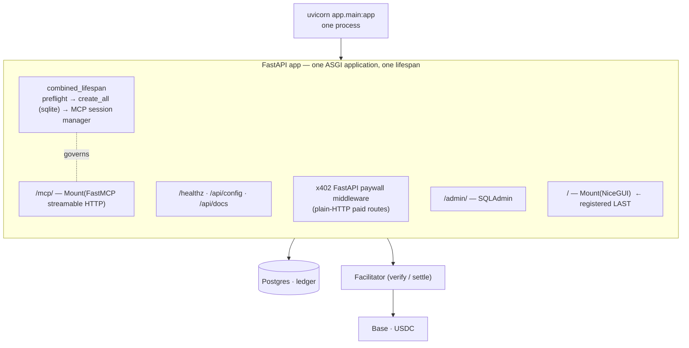
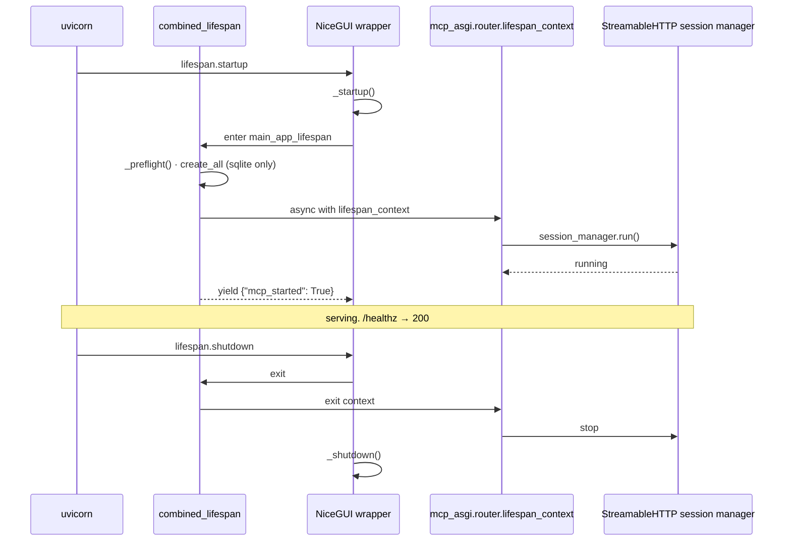
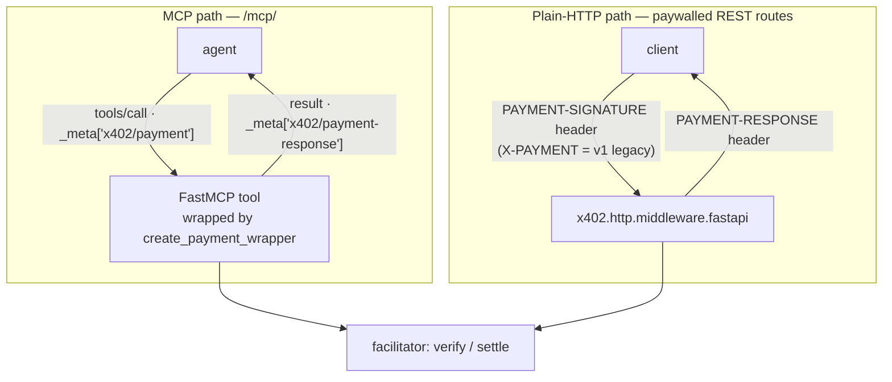
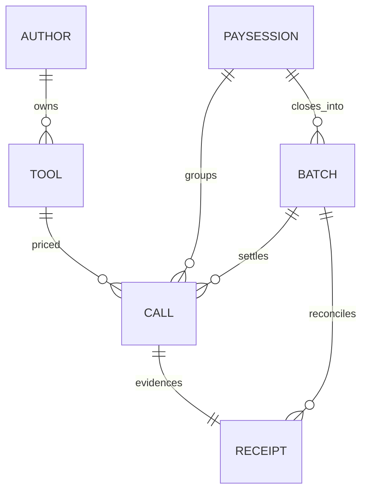
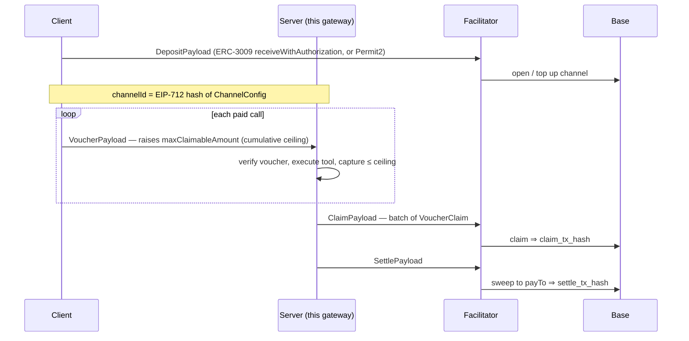
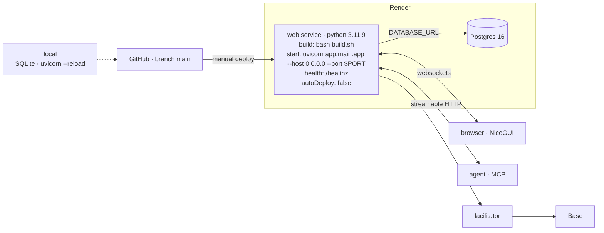

# Architecture

How TRAPPIST × BRAINWAVE is composed, why the composition order is not arbitrary, and the four
places where the installed SDKs disagree with their own documentation.

Everything in this document was established by **running the installed wheels** —
`nicegui==3.15.0`, `x402[all]==2.16.0`, `mcp==1.28.1`, `fastapi==0.140.2`, `starlette==1.3.1` —
not by reading a README. Where a claim was verified by reproducing a failure, it says so.

---

## Contents

- [One service, four surfaces](#one-service-four-surfaces)
- [Why FastAPI, and why that follows from NiceGUI](#why-fastapi-and-why-that-follows-from-nicegui)
- [Composition order](#composition-order)
- [The lifespan problem](#the-lifespan-problem)
- [Request-path map](#request-path-map)
- [Mounting FastMCP: three traps](#mounting-fastmcp-three-traps)
- [Where payment actually travels](#where-payment-actually-travels)
- [The ledger](#the-ledger)
- [SDK contradictions found by running the wheels](#sdk-contradictions-found-by-running-the-wheels)
- [Extension seams](#extension-seams)
- [Deployment topology](#deployment-topology)
- [Failure modes and how each one is caught](#failure-modes-and-how-each-one-is-caught)

---

## One service, four surfaces



Four surfaces, one deployable:

| Surface | Consumer | Technology |
|---|---|---|
| `/mcp/` | agents | FastMCP streamable HTTP, JSON-RPC |
| `/admin/` | operator | SQLAdmin over the raw ledger |
| `/` | tool author | NiceGUI, written in Python |
| `/healthz`, `/api/*` | ops, agent operators | FastAPI |

There is no worker process, no Redis, no scheduler service, no static site, and no Node build
step. The repository contains no `package.json`.

---

## Why FastAPI, and why that follows from NiceGUI

**NiceGUI is FastAPI underneath.** `ui.run_with(app)` takes an existing FastAPI app and mounts
NiceGUI onto it. That one fact makes three otherwise-separate decisions collapse into one:

### 1. x402 ships official FastAPI middleware

`x402.http.middleware.fastapi` exports `payment_middleware`, `payment_middleware_from_config`,
`PaymentMiddlewareASGI` and `set_settlement_overrides`. There is **no Django middleware** in the
SDK. Being FastAPI-shaped means the plain-HTTP paywall is first-party rather than hand-rolled,
which for a payment gateway is not a convenience — it is the difference between conforming to
the spec and approximating it.

### 2. FastMCP's ASGI app is a Starlette app

Verified by running it:

```python
>>> type(FastMCP(name="x").streamable_http_app())
<class 'starlette.applications.Starlette'>
```

FastAPI mounts a Starlette app in one line: `app.mount("/mcp", mcp_asgi)`. Against a Django
project the equivalent needs a hand-written ASGI path dispatcher, plus manual lifespan
plumbing — which, as [below](#the-lifespan-problem), is exactly the part that silently
half-works.

### 3. A real frontend in pure Python

Reactive components, tables and built-in ECharts, with **no HTML, CSS, JS, Node or npm anywhere
in this repository**. The brand palette lives as Python string constants in `app/dashboard.py`
and is applied through `ui.colors()` and inline styles, because NiceGUI is styled in Python.

```python
BG = "#1d0718"
FG = "#fbf4f2"
ACCENT = "#ff6f91"
ACCENT_DEEP = "#e6416f"
CREAM = "#fff3ec"
```

---

## Composition order

`app/main.py`, in order. Every step is placed where it is for a reason that was tested.

```python
mcp      = get_mcp()                      # 0. singletons, at module scope
mcp_asgi = mcp.streamable_http_app()

@contextlib.asynccontextmanager           # 1. combined lifespan
async def combined_lifespan(app): ...

app = FastAPI(lifespan=combined_lifespan, # 2. the app
              docs_url="/api/docs", redoc_url=None,
              openapi_url="/api/openapi.json")

app.mount("/mcp", mcp_asgi, name="mcp")   # 3. paid MCP + explicit 307 for bare /mcp

@app.get("/healthz")   ...                # 4. free routes,
@app.get("/api/config") ...               #    THEN the x402 HTTP paywall
_install_http_paywall()

admin = mount_admin(app)                  # 5. SQLAdmin /admin + explicit 307

dashboard.install(app)                    # 6. NiceGUI @ui.page("/") registrations

ui.run_with(app, ...)                     # 7. LAST. ALWAYS.
```

### Step 0 — the singletons must be singletons

`streamable_http_app()` lazily builds the StreamableHTTP **session manager** on first call, and
the lifespan in step 1 is bound to *that* instance. The session manager also refuses to be run
twice. So `get_mcp()` memoises the `FastMCP` instance and `mcp_asgi` is built exactly once, at
module scope.

### Step 2 — docs move out of NiceGUI's way

FastAPI's interactive docs default to `/docs`, which is fine until NiceGUI owns `/`. They are
relocated to `/api/docs`, and ReDoc is disabled.

### Step 4 — free routes before the paywall

`/healthz` and `/api/config` are registered before `_install_http_paywall()` so their ordering
relative to the middleware is explicit rather than incidental. Health checks and gateway
discovery must never be behind a paywall: an agent has to be able to learn a price before
deciding to pay it.

### Step 7 — `ui.run_with()` is last, and this is not a style preference

`ui.run_with()` performs `app.mount("/", nicegui_app)`. Starlette resolves routes **in
registration order**, and `Mount("/")` matches every path. Anything registered after it is
unreachable.

**Reproduced:** with NiceGUI mounted first, a `POST /mcp/` returns NiceGUI's HTML 404 page
instead of JSON-RPC. Not an error, not a log line — an agent just sees HTML where it expected a
protocol.

---

## The lifespan problem

This is the one genuinely tricky integration point in the whole build, and it is dangerous
precisely because the broken version looks correct.

### What is true

**A mounted sub-app's lifespan never runs.**

Starlette dispatches the `lifespan` scope in `Router.lifespan()`. `Mount` matches only `http`
and `websocket` scopes. So the lifespan of a mounted application is simply never entered — no
startup, no shutdown, no warning.

Probe result, pinned as `tests/test_spine.py::test_mounted_lifespan_does_not_run_on_its_own`:

| | parent lifespan | mounted sub-app lifespan |
|---|---|---|
| startup | fired | **did not fire** |
| shutdown | fired | **did not fire** |

### Why it matters here

```python
# mcp/server/fastmcp/server.py, roughly
def streamable_http_app(self) -> Starlette:
    return Starlette(
        routes=[...],
        lifespan=lambda app: self.session_manager.run(),  # ← the only place it starts
    )
```

The StreamableHTTP **session manager** is started by that lifespan and by nothing else. Mount
the app naively and:

- routes resolve ✅
- `tools/list` may appear to work depending on transport mode
- **every `tools/call` returns 500 Internal Server Error** ❌
- nothing is logged to explain it

Reproduced both ways: unwired → 500; wired → the request reaches the MCP transport.

### The fix

```python
@contextlib.asynccontextmanager
async def combined_lifespan(app: FastAPI) -> AsyncIterator[dict]:
    _preflight()
    if DATABASE_URL.startswith("sqlite"):
        create_all()

    # THE LOAD-BEARING LINE.
    async with mcp_asgi.router.lifespan_context(mcp_asgi):
        app.state.mcp_started = True
        try:
            yield {"mcp_started": True}
        finally:
            app.state.mcp_started = False
```

Go through `router.lifespan_context`, **not** `session_manager.run()` directly. The indirection
means any future FastMCP startup work comes along for free instead of being silently skipped
the next time the SDK adds some.

### NiceGUI does not clobber it

A reasonable fear: `ui.run_with()` runs after the app is constructed and NiceGUI has its own
startup/shutdown. Does it replace the constructor-passed lifespan?

**No.** It *reads* `app.router.lifespan_context`, wraps it, and puts the wrapper back:

```
_startup()  →  async with main_app_lifespan(app):  ...  →  _shutdown()
```

A lifespan passed to `FastAPI(...)` still runs, and its yielded state still propagates.
Confirmed by probe with NiceGUI installed — observed order:

```
SUB_STARTUP → PARENT_STARTUP → PARENT_SHUTDOWN → SUB_SHUTDOWN
```

### The regression alarm

`/healthz` reads `app.state.mcp_started` and returns **503** with
`"mcp_session_manager": "NOT STARTED"` if the wiring ever breaks. Render's health check points
at it. A silent, expensive failure is converted into a loud, free one.



---

## Request-path map

| Path | Handler | Registered at | Auth | Paid |
|---|---|---|---|---|
| `/mcp/` | `Mount("/mcp", FastMCP.streamable_http_app())` | step 3 | none at transport | **per tool** (`_meta`) |
| `/mcp` | 307 → `/mcp/`, method + body preserved | step 3 | — | — |
| `/healthz` | FastAPI · 200 healthy, **503 if MCP lifespan did not run** | step 4 | none | no |
| `/api/config` | FastAPI · network, asset, facilitator, both transports | step 4 | none | no |
| `/api/docs`, `/api/openapi.json` | FastAPI (moved off `/docs`) | step 2 | none | no |
| *paywalled HTTP routes* | x402 `payment_middleware` | step 4 | payment | **yes** (headers) |
| `/admin/` | SQLAdmin | step 5 | operator login | no |
| `/admin` | 307 → `/admin/` | step 5 | — | — |
| `/receipts/{id}/verify` | FastAPI · re-check hash, attestation, chain | step 4 | none | **never** |
| `/` | NiceGUI `@ui.page("/")` | step 6 | none | no |
| `/_nicegui/*` | NiceGUI static + websocket | step 7 | none | no |
| *everything else* | NiceGUI's `Mount("/")` catch-all | step 7 | — | — |

The last row is why order matters: after step 7 there is no such thing as an unmatched path.

---

## Mounting FastMCP: three traps

### 1. The double path

`FastMCP.streamable_http_app()` registers its endpoint at `settings.streamable_http_path`, which
**defaults to `/mcp`**. Mount that sub-app at `/mcp` and the endpoint is `/mcp/mcp`.

Fix: build FastMCP with `streamable_http_path="/"`, then mount at `/mcp`. The endpoint is
exactly `/mcp/`.

### 2. The bare path does not match the mount

Starlette's `Mount("/mcp")` compiles to `^/mcp(?P<path>/.*)$`. The bare path `/mcp` does not
match it. Normally FastAPI's `redirect_slashes` would rescue that — but NiceGUI's `Mount("/")`
matches `/mcp` first and returns an HTML 404.

Fix: an explicit route, registered at step 3 so it resolves before NiceGUI:

```python
@app.api_route("/mcp", methods=["GET", "POST", "DELETE", "OPTIONS"], include_in_schema=False)
async def _mcp_slash_redirect():
    return RedirectResponse(url="/mcp/", status_code=307)  # 307 preserves method + body
```

**307, not 301/302** — a 302 would turn a `POST` with a JSON-RPC body into a `GET`. The same
pattern is applied to `/admin`.

### 3. DNS-rebinding protection is on by default

`mcp==1.28.1` constructs
`TransportSecuritySettings(enable_dns_rebinding_protection=True, allowed_hosts=['127.0.0.1:*', 'localhost:*', '[::1]:*'])`
**by default**.

Deploy to `something.onrender.com` and **every MCP request returns 421 "Invalid Host header."**
Reproduced.

Fix: derive the allowlist from `PUBLIC_BASE_URL`, so the deployed host is always permitted:

```python
transport_security = TransportSecuritySettings(
    enable_dns_rebinding_protection=settings.mcp_dns_rebinding_protection,
    allowed_hosts=settings.mcp_host_allowlist,  # PUBLIC_BASE_URL + localhost + extras
    allowed_origins=settings.mcp_origin_allowlist,
)
```

`MCP_ALLOWED_HOSTS` / `MCP_ALLOWED_ORIGINS` add extras. Protection is left **on** — turning it
off would be the easy fix and the wrong one.

### Statelessness, deliberately

`MCP_STATELESS=true` and `MCP_JSON_RESPONSE=true`. No server-side MCP session affinity, so a
single Render web service can restart without stranding clients.

**Payment sessions are our concept and live in Postgres, not in the MCP transport.** A restart
loses no revenue state. This is the reason the architecture can be one web service instead of a
sticky-session cluster.

---

## Where payment actually travels

Two transports on the same server, two different carriers for the same protocol. Conflating
them is the most common integration mistake, so the distinction is enforced in code rather than
merely documented.



Verified constants:

| Constant | Value | Source |
|---|---|---|
| `MCP_PAYMENT_META_KEY` | `"x402/payment"` | `x402.mcp` |
| `MCP_PAYMENT_RESPONSE_META_KEY` | `"x402/payment-response"` | `x402.mcp` |
| `PAYMENT_SIGNATURE_HEADER` | `"PAYMENT-SIGNATURE"` | `x402/http/constants.py` |
| `PAYMENT_RESPONSE_HEADER` | `"PAYMENT-RESPONSE"` | `x402/http/constants.py` |
| `X_PAYMENT_HEADER` | `"X-PAYMENT"` — commented **`# V1 legacy`** | `x402/http/constants.py` |
| `X_PAYMENT_RESPONSE_HEADER` | `"X-PAYMENT-RESPONSE"` — **`# V1 legacy`** | `x402/http/constants.py` |

The FastAPI middleware reads `payment-signature` *or* `x-payment`. Over MCP neither applies.

Three enforcement points:

1. `GET /api/config` returns `paymentTransport.mcp` and `paymentTransport.http` as **separate
   objects**, pinned by `test_public_config_is_precise_about_the_two_transports`.
2. The free `gateway_info` MCP tool returns the `_meta` keys and a note saying headers do not
   apply on this transport.
3. `app/paywall.py` **must** short-circuit `/mcp*` — running the HTTP paywall over the MCP mount
   would hunt for a header that is correctly never present.

There is also no literal HTTP 402 over MCP. The challenge is a payment-required *result* inside
a 200 JSON-RPC response. Same four steps, different envelope.

---

## The ledger



Six reporting-ledger tables exist to make one claim checkable from the database alone:

> `Σ(Call.captured_atomic)` for a session **==** the `Batch.gross_atomic` settled on-chain
> **==** what the tx hash actually moved.

Design rules, enforced rather than stated:

| Rule | Mechanism |
|---|---|
| Money is integer atomic units | Every `*_atomic` column is `BigInteger`. `int` alone maps to 32-bit `INTEGER` on Postgres and overflows near 2,147 USDC |
| No float exists anywhere | `test_no_float_columns_anywhere_in_the_ledger` walks the metadata |
| Capture never exceeds authorization | `CHECK ck_call_capture_le_authorized` — an `upto` metering bug is a DB error, not a silent overcharge |
| Splits conserve | `CHECK ck_call_split_conserves`, `CHECK ck_batch_split_conserves` |
| A session never settles more than it captured | `CHECK ck_session_settled_le_captured` |
| A nonce is used at most once per network | `UNIQUE (network, nonce)` — replay defence at the storage layer |
| Enums store the **wire** value | `sa_type=String(32)`, not `sa.Enum` — the ledger holds `batch-settlement`, never `BATCH_SETTLEMENT` |
| Timestamps are timezone-aware | `DateTime(timezone=True)`; `utcnow()` never `datetime.utcnow()` |

Two schema decisions worth their own note:

**`Session.authorized_atomic` is a ceiling, not a sum.** Under `batch-settlement` the accumulator
is a payment *channel* carrying a monotonic cumulative voucher (`VoucherPayload` raising
`maxClaimableAmount`), not a pile of independent authorizations. Modelling it as a sum would make
every reconciliation report wrong.

**`Batch` carries two tx hashes.** `batch-settlement` closes in two on-chain steps —
`ClaimPayload` (claim the vouchers) then `SettlePayload` (sweep to the receiver). A batch whose
claim landed but whose sweep did not is a real state that must be representable.

**Spendable channel material is separate and encrypted.** The seventh table, `channel_state`,
stores only Fernet-encrypted SDK channel payloads keyed by `channel_id`. `app/channels.py`
derives the encryption key from `STORAGE_SECRET`; the web service and the explicit batch-close
command can share and resume state without exposing signatures in the reporting ledger.

### SQLModel gotchas found while building

1. **`from __future__ import annotations` breaks `Relationship`.** It stringifies every
   annotation, and SQLAlchemy then cannot resolve `list["Tool"]` — it raises *"seems to be using
   a generic class as the argument to relationship()"*. `app/models.py` is the one module in the
   package without the future import, and says so in a comment.
2. **SQLModel's default for a `StrEnum` field is `sa.Enum`.** On Postgres that creates a
   **native ENUM type** (adding a value later needs `ALTER TYPE`, removing one is a table
   rebuild) and stores the member **name**. The ledger would hold `BATCH_SETTLEMENT` where the
   x402 wire format says `batch-settlement`. Forced to `String(32)`; pinned by
   `test_enum_columns_store_the_x402_wire_value_not_the_member_name`.
3. **`sqlmodel.Session` collides with our `Session` model.** The class stays `Session` as
   designed; `PaySession` is exported as an unambiguous alias for modules that also open DB
   sessions.

### Engine

`app/db.py`:

- Rewrites Render's legacy `postgres://` to `postgresql://`, which SQLAlchemy 2 requires. **No
  `dj-database-url`** — SQLAlchemy parses the URL directly, which is why that dependency does not
  appear in `requirements.txt`.
- SQLite pragmas on connect: `foreign_keys=ON` (off by default — for a ledger that is wrong),
  `journal_mode=WAL`, `synchronous=NORMAL`.
- `check_same_thread=False`: NiceGUI, the MCP transport and the batch closer all touch the DB
  from different threads in one process.
- `StaticPool` for in-memory SQLite, or every session sees an empty schema (the tests rely on
  this).
- Postgres gets `pool_pre_ping=True` and `pool_recycle=1800` — managed Postgres drops idle
  connections, and without this the first request after a quiet period fails.

Alembic owns the schema in every real deployment (`build.sh` runs `alembic upgrade head`).
`create_all()` runs only against the local SQLite fallback. `alembic/env.py` takes the URL from
`app.db`, which is why `alembic.ini` deliberately carries no URL.

---

## SDK contradictions found by running the wheels

Four places where the installed packages disagree with their own documentation or with the
draft spec. Each is reproduced, worked around, and pinned by a test that will fail loudly when
upstream fixes it.

### 1. `x402.mcp.ResourceInfo` is the wrong class — an SDK bug

The SDK's own module docstring says:

```python
from x402.mcp import create_payment_wrapper, ResourceInfo
```

That `ResourceInfo` resolves, via `x402/mcp/__init__.py`'s lazy `__getattr__`, to
`x402.mcp.types.ResourceInfo` — **a plain class with no `model_dump()`**. But
`x402/mcp/server.py::_create_payment_required_result` calls
`resource.model_dump(by_alias=True, exclude_none=True)`.

Following the documented import therefore raises

```
AttributeError: 'ResourceInfo' object has no attribute 'model_dump'
```

on the **first unpaid call** — i.e. the 402 challenge itself, the one path that must never fail.

**Workaround:**

```python
from x402.mcp import create_payment_wrapper
from x402.schemas.payments import ResourceInfo  # ← the pydantic one, has model_dump()
```

Pinned by `test_x402_mcp_resource_info_is_the_wrong_class`, documented in `app/mcp_app.py`.

### 2. Network ids are CAIP-2

`PaymentRequirements.network` is `eip155:84532` / `eip155:8453`. The draft spec's
`X402_NETWORK=base-sepolia` is a **v1 spelling** and will not match.

`app/config.py` rejects anything without a colon, with an error message that says why. USDC
addresses are read from `x402.mechanisms.evm.constants.NETWORK_CONFIGS`, never from memory.

### 3. `batch-settlement` is not "sum N authorizations"

It is a payment **channel** plus a monotonic cumulative **voucher**:



Consequences already in the schema: `Session.channel_id`, `Session.authorized_atomic` as a
ceiling, `Batch.claim_tx_hash` **and** `Batch.settle_tx_hash`.

**Do not build a parallel batching mechanism beside it.** `x402.mechanisms.evm.batch_settlement`
ships `client/`, `server/`, `facilitator/`, `abi.py`, `encoding.py` and `types.py`; our job is
accounting on top of it, not a second protocol.

### 4. The TypeScript buyer shim is unnecessary

`x402/mechanisms/evm/signers.py` provides `EthAccountSigner`, `EthAccountSignerWithRPC` and
`FacilitatorWeb3Signer`, all built on `eth-account`. **EIP-3009 authorization signing needs no
JavaScript.** The draft spec's Next.js/TypeScript shim would add an entire toolchain to solve a
problem that does not exist.

Verified scheme inventory in `x402==2.16.0`:

| Mechanism | Schemes present |
|---|---|
| `x402.mechanisms.evm` | `exact`, `upto` (incl. a Permit2 variant), `batch_settlement` |
| `x402.mechanisms.svm` (Solana) | `exact` |
| `x402.mechanisms.tvm` (TON) | `exact`, plus `streaming.py` |

---

## Extension seams

Three modules the spine imports **optionally**. Absent, the app stands up, logs one line, and
serves the free tools and the dashboard. That is deliberate: the spine must be inspectable and
deployable while the rest is being written.

| Seam | Contract |
|---|---|
| `app/catalogue.py::register_tools(mcp)` | Attach `@paid()` tools to the passed `FastMCP`. Called from `app/mcp_app.py::_register_catalogue`. `ImportError` → free tools only; any other exception is logged, not raised |
| `app/paywall.py::install(app)` | Wire `x402.http.middleware.fastapi.payment_middleware(routes, server)`. **Must** short-circuit `/mcp*`, `/` and `/_nicegui*`. It is a `BaseHTTPMiddleware`, which buffers response bodies — keep it off streaming routes |
| `app/guardian.py` | Buyer-side spend policy, evaluated **before** any signature exists |

Two more verified facts for whoever writes `@paid()`:

- `create_payment_wrapper` **injects a synthetic `ctx: Context` parameter** into the wrapped
  function's signature, so FastMCP's `find_context_parameter()` supplies the request context. Do
  **not** declare `ctx` in a tool handler, and do **not** rebuild `__signature__` after the
  wrapper — payment metadata arrives via that context and nowhere else.
- **Decorator order:** `@mcp.tool(...)` **outside**, `@wrapper` **inside**. Reversed, the tool
  registers the unpaid function and the paywall silently does nothing.

```python
wrapper = create_payment_wrapper(
    resource_server,
    accepts=accepts,
    resource=ResourceInfo(url="mcp://tool/run_injection_attack_sim"),
)


@mcp.tool(name="run_injection_attack_sim")  # outside
@wrapper  # inside
async def run_injection_attack_sim(payload: str, rounds: int = 3) -> str: ...
```

---

## Deployment topology

One Render web service, one Postgres. `render.yaml` is written; **this repository never runs
it.**



`build.sh`:

```bash
pip install --upgrade pip
pip install -r requirements.txt
alembic upgrade head          # Alembic owns the schema; create_all() is SQLite-only
```

Notes that matter in production:

- **Websockets.** NiceGUI needs them for reactive updates; MCP streamable HTTP needs long-lived
  connections. Render supports both on the standard HTTP port with nothing to enable.
- **`--proxy-headers --forwarded-allow-ips '*'`** so the app sees the real scheme and host behind
  Render's proxy.
- **`PUBLIC_BASE_URL` must match the service URL.** Two things break silently otherwise: the MCP
  endpoint advertised to agents, and the MCP host allowlist (→ 421 on every request).
- **Plan.** The free tier sleeps, and a sleeping payment gateway is not one.
- **Secrets** (`PAY_TO_ADDRESS`, `CDP_API_KEY_*`, `ADMIN_PASSWORD`) are `sync: false` — set in the
  dashboard, never committed.
- **`STORAGE_SECRET`** uses `generateValue: true`. The app refuses to boot in production with the
  development default.

### Preflight — refusing configurations that deploy broken but report healthy

`_preflight()` runs inside the lifespan, before anything serves. In `APP_ENV=production` it
**raises** on:

| Condition | Why it is fatal |
|---|---|
| `STORAGE_SECRET` still the dev default | session cookies forgeable |
| `ADMIN_ENABLED` with an empty `ADMIN_PASSWORD` | an unauthenticated ledger editor on the public internet |
| `PAY_TO_ADDRESS` is the zero address | revenue would be burned |
| `DATABASE_URL` is SQLite | the ledger would not survive a redeploy |
| No asset address for the configured network | payment requirements would be unpayable |

And it **warns** on mainnet configured outside production (real USDC at risk) and on
`PUBLIC_BASE_URL` still being localhost.

---

## Failure modes and how each one is caught

| Failure | Symptom without the guard | Guard |
|---|---|---|
| Mounted MCP lifespan not entered | every `tools/call` → 500, nothing logged | `async with mcp_asgi.router.lifespan_context(...)`; `/healthz` → 503 `"NOT STARTED"`; two pinned tests |
| NiceGUI mounted before `/mcp` | agent gets NiceGUI's HTML 404 | `ui.run_with()` is the last statement; `test_paid_mcp_endpoint_speaks_json_rpc` |
| Bare `/mcp` requested | HTML 404 | explicit 307, `test_bare_mcp_path_redirects_instead_of_hitting_nicegui` |
| Deployed host not in MCP allowlist | 421 on every request | allowlist derived from `PUBLIC_BASE_URL` |
| Endpoint at `/mcp/mcp` | agent 404s at the documented URL | `streamable_http_path="/"` |
| Money as float | rounding drift, ledger claim becomes an artefact | `BigInteger` everywhere; `PriceError` on inexact input; two pinned tests |
| Enum stored as member name | ledger holds `BATCH_SETTLEMENT`, receipts disagree with the wire | `String(32)`; pinned test |
| `upto` overcapture | silent overcharge | `CHECK ck_call_capture_le_authorized` |
| Replayed authorization | double charge | `UNIQUE (network, nonce)` |
| Documented `ResourceInfo` import | `AttributeError` on the first 402 challenge | import from `x402.schemas.payments`; pinned test |
| Prod deploy with dev secrets / SQLite / zero payTo | looks healthy, is not | `_preflight()` raises before serving |

---

*See also:* [`ECONOMICS.md`](ECONOMICS.md) · [`SPEC_CONFORMANCE.md`](SPEC_CONFORMANCE.md) ·
[`DEMO_SCRIPT.md`](DEMO_SCRIPT.md) · [`../README.md`](../README.md)
